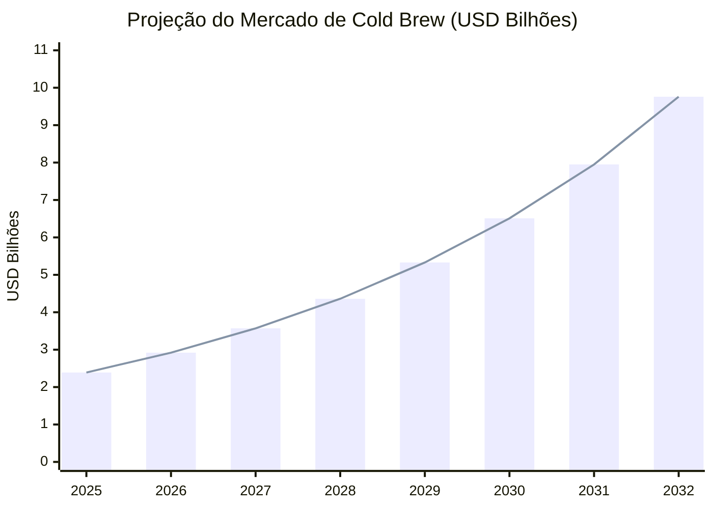
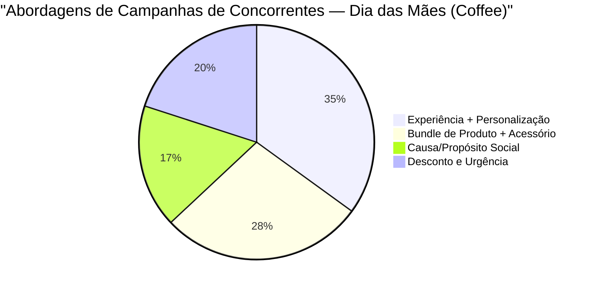
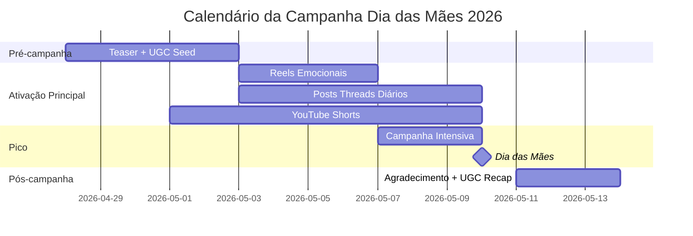

# Briefing de Pesquisa de Mercado
## Campanha: Dia das Mães 2026 — Cold Brew Coffee Co.

**Data:** 10 de maio de 2026
**Plataformas:** Instagram · Threads · YouTube
**Público comprador:** Filhos adultos (18–35 anos) que querem presentear suas mães
**Tema central:** Conexão mãe-filhos através do ritual do cold brew

---

## 1. Visão Geral do Mercado

O mercado global de cold brew está em expansão acelerada — projeção de crescimento de **USD 2,39 bilhões em 2025 para USD 9,76 bilhões até 2032**, com CAGR de 22,26%. O formato RTD (pronto para beber) domina mais de 60% da receita, o que valida diretamente o posicionamento do produto da Cold Brew Coffee Co.

O Dia das Mães é, historicamente, uma das datas de maior volume de buscas sazonais — registrando **586% de crescimento em buscas** no período pré-data. O público que compra presente de café para mãe está ativamente procurando algo mais do que prático: quer experiência, conexão, memória.



---

## 2. Perfil do Consumidor e Dores

**Quem compra:** Filhos adultos de 20–35 anos, nativos digitais, com renda média-alta, que valorizam qualidade e experiências sobre objetos genéricos.

### Principais Dores
| Dor | Impacto na Decisão de Compra |
|---|---|
| Flores murcham em poucos dias | Alta — buscam presente duradouro |
| Presentes genéricos não expressam carinho real | Alta — querem algo pensado |
| Difícil criar um momento com a mãe em rotinas corridas | Muito Alta — querem experiência |
| Produtos premium parecem complicados de usar | Média — preferem conveniência |

### Gatilhos Emocionais Mais Fortes
1. **Nostalgia** — memórias de café da manhã na infância
2. **Gratidão** — reconhecimento do cuidado constante da mãe
3. **Reciprocidade** — "ela sempre cuidou de você, agora cuide do momento dela"
4. **Conexão** — o café como pretexto para estar junto

---

## 3. Análise de Concorrentes



### Lacuna Identificada — Oportunidade da Cold Brew Coffee Co.

> **Nenhum concorrente explora o ritual de preparar cold brew JUNTO com a mãe como ato de conexão.**

A maioria posiciona o café como produto-presente isolado. A Cold Brew Coffee Co. tem a oportunidade de ocupar o espaço de **"o café que aproxima"** — o catalisador de um momento afetivo real entre mãe e filho.

---

## 4. Ângulos de Posicionamento Estratégico

### Ângulo Primário: "Café como Pretexto para Conexão"
> "O cold brew não é só uma bebida — é o motivo para sentar, conversar e estar presente."

**Por que funciona:** Pesquisas mostram que mensagens ancoradas em *significado emocional* ("o que isso representa") superam campanhas centradas em preço ou funcionalidade. Esse ângulo diferencia a marca de todos os concorrentes.

### Ângulo Secundário: "O Presente que Volta Todo Dia"
> "Enquanto flores murcham, o cold brew está lá toda manhã — um presente que ela usa e lembra de você."

**Por que funciona:** Combate diretamente a dor de presentes efêmeros. Cria uma associação duradoura entre a marca e o ritual da mãe.

### Ângulo de Suporte: "Upgrade da Manhã Dela"
> "Ela sempre cuidou do seu café da manhã. Agora é a sua vez de elevar o dela."

**Por que funciona:** Cria urgência emocional por reciprocidade, com framing positivo e empoderador.

---

## 5. Hooks de Anúncio com Maior Potencial

| # | Hook | Plataforma Ideal |
|---|---|---|
| 1 | "Ela sempre acordou primeiro. Desta vez, surpreenda ela." | Instagram Reels / YouTube |
| 2 | "O presente que ela vai usar todo dia — e lembrar de você." | Instagram Feed / Threads |
| 3 | "Café é pretexto. Conexão é o presente de verdade." | Threads / Stories |
| 4 | "Mais duradouro que flores. Mais saboroso que qualquer coisa." | YouTube Shorts |
| 5 | "Cada gole, ela vai lembrar de você. ☕" | Threads / Instagram |

---

## 6. Tópicos de Conteúdo Viral

### Conteúdo Orgânico de Alto Engajamento
- **UGC:** "O café que a gente faz junto" — filhos postam momento com a mãe
- **Reel nostálgico:** "Esse cheiro de café da manhã..." — memórias afetivas
- **Tutorial compartilhado:** Mãe e filho preparando cold brew — simples, rápido, afetivo
- **Antes/Depois:** Manhã corrida vs. manhã com cold brew e pausa com a mãe

### Estratégia de Hashtags Recomendada
```
#DiadasMães  #ColdBrewCoffeeCo  #ColdBrew
#ManhãComAmor  #PresenteParaMãe  #CaféComCarinho  #MomMoment
```

---

## 7. Conceitos de Vídeo para Agentes Criativos

### Conceito 1 — "Manhã Com Ela" *(Prioridade Alta)*
- **Gancho:** "Você lembra do cheiro do café dela na sua infância? Agora é a sua vez."
- **Duração:** 20–25 segundos | **Formato:** 1080×1080
- **Arco:** Nostalgia → Gratidão → Ação
- **CTA:** `Presenteie Ela`

### Conceito 2 — "O Café Que Faz Questão" *(Prioridade Alta)*
- **Gancho:** "Ela sempre acordou primeiro. Agora, surpreenda ela antes das 8h."
- **Duração:** 15 segundos | **Formato:** 1080×1920 (Reel/Story)
- **Arco:** Reconhecimento → Surpresa → Conexão
- **CTA:** `Grab Yours`

### Conceito 3 — "Juntos na Cozinha" *(Prioridade Média)*
- **Gancho:** "O melhor presente? Tempo. E cold brew é o pretexto perfeito."
- **Duração:** 30 segundos | **Formato:** 1080×1080
- **Arco:** Cotidiano → Afeto → Memória
- **CTA:** `Presenteie Sua Mãe`

---

## 8. Calendário de Distribuição Recomendado



---

## 9. Palavras-Chave Estratégicas

| Categoria | Palavras-Chave |
|---|---|
| **Intenção de Compra** | cold brew dia das mães, presente de café para mãe, cold brew presente premium |
| **Ritual/Momento** | ritual matinal presente especial, café afetuoso mãe filhos, manhã especial mãe |
| **Produto** | cold brew pronto para beber presente, cold brew coffee presentes 2026 |
| **Emoção** | presente que dura todo dia, café com carinho, conexão família café |

---

## 10. Recomendações para Agentes Downstream

| Agente | Prioridade | Diretiva |
|---|---|---|
| **Video Ad Specialist** | 🔴 Alta | Desenvolver "Manhã Com Ela" — arco nostálgico, estilo flat Kurzgesagt com paleta #2C1A0E + #F5A623 |
| **Ad Creative Designer** | 🔴 Alta | Layout focado em conexão mãe-filho. Headline: "O Presente que Ela Usa Todo Dia." CTA: "Presenteie Ela" |
| **Copywriter Agent** | 🟡 Média | Ângulo principal: "Café como Pretexto para Conexão". Tom emocional e acolhedor para todas as plataformas |
| **Distribution Agent** | 🟢 Normal | Scheduling: Instagram pico 7–9 mai; YouTube publicar 1 mai; Threads daily 3–10 mai |

---

*Pesquisa gerada por Marketing Research Agent · Cold Brew Coffee Co. · Dia das Mães 2026*
