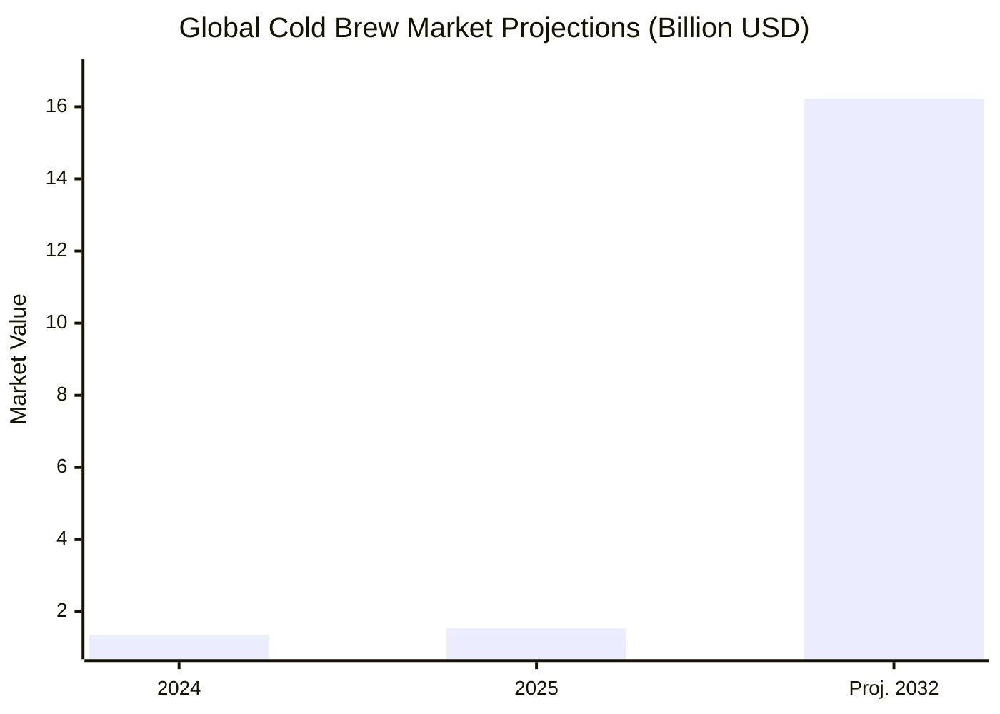
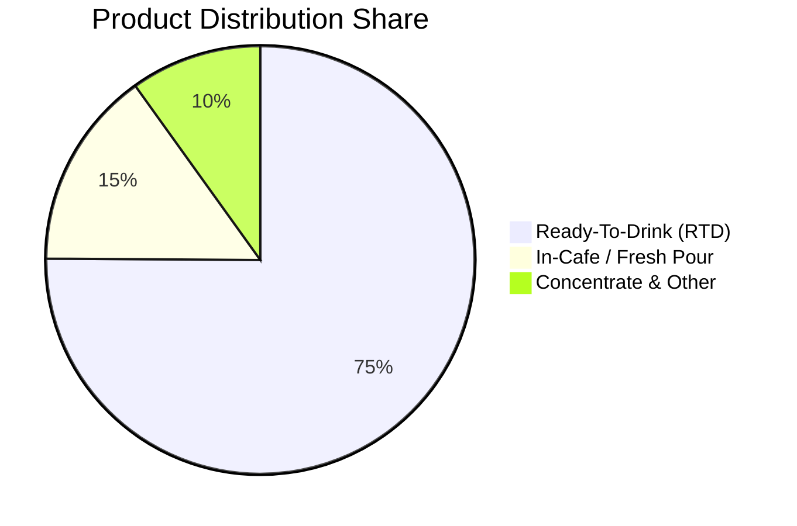

# Executive Summary

The cold brew market is experiencing explosive growth, fundamentally shifting from a seasonal summertime treat to a year-round, daily necessity for young professionals. 

Valued at **$1.35 Billion in 2024**, it is projected to hit **$1.54 Billion in 2025** and skyrocket to **$16.22 Billion by 2032**. This reflects a massive Compound Annual Growth Rate (CAGR) of 22.7%. 

What drives this? Consumers are prioritizing convenience through ready-to-drink (RTD) packaging, desiring unparalleled smoothness (low acidity) over hot coffee, and treating cold brew as a delivery system for functional health additions (like adaptogens, collagen, and plant-based milks).

> **Strategic Insight:** Cold brew is no longer just caffeine. It is "clean energy" that promises sustained focus without stomach upset or midway crashes. 

---

# Market Trajectory & Growth

The global outlook showcases aggressive expansion. Young professionals treat cold brew as an anchor of their day. 

## Product Segmentation

Consumers demand maximum convenience. The market is overwhelmingly leaning toward canned and bottled Ready-To-Drink (RTD) formats over concentrate or in-cafe purchases, primarily due to the rise of remote and hybrid work environments.

---

# Consumer Motivations & Pain Points

1. **Stomach / Digestive Sensitivity** 
   Traditional hot coffee causes acid reflux and jittery spikes. Cold brew offers a low-acid, smooth alternative, retaining its integrity even when diluted by ice.
2. **Functional Wellness** 
   The pursuit of "clean energy." Buyers want sugar-free caffeine with added benefits like oat milk, probiotics, and nootropics for sustained focus without the crash.
3. **The Aesthetic "Little Treat" Culture** 
   These are highly visual drinks. Over-the-top cold foams, bold colors from matcha infusions, and customized layer separations cater to the *"Sip, Snap, Share"* social media mentality.
4. **Year-Round Consumption** 
   Cold brew is universally recognized as a daily productivity tool, breaking past the limitation of only being a summer drink.

---

# Competitor Strategy & Positioning

How are competitors marketing to this demographic?

- **Premium Experience at Scale:** Brands highlight artisanal brewing methods (e.g., slow 24-hour steeping, nitro infusion cascades) to justify premium price points.
- **Health over Caffeine:** Marketing copy consistently emphasizes the absence of negative side effects (no afternoon crash, zero sugar guilt, dairy-free alternatives).
- **Scarcity & Seasonal Drops:** Mimicking streetwear hype drops, cafes and D2C brands launch limited-edition seasonal cold foams to drive pure FOMO.
- **Role-Based Efficiency:** B2B-targeted coffee marketing sells "time back"—an uninterrupted, focused Friday afternoon—not just a caffeinated beverage.

---

# Social Media & Content Strategy

To successfully penetrate this market, downstream creative agents (Distribution, Image, and Video Ad agents) must leverage these proven angles and visual aesthetics to maximize engagement on Instagram Reels, TikTok, and YouTube Shorts.

## Top Visual Hooks

- **ASMR Pours:** Extreme macro shots of ice clinking and cascading cold foam.
- **Transparent Brewing:** Showing the visual swirl of the 24-hour slow steep to validate the "premium" feeling.
- **Productivity Overlays:** Time-lapse of a messy desk getting clean while drinking the cold brew.
- **Before/After Transformations:** From groggy morning vibes to sharp, closing-ready focus.

## High-Converting Ad Angles

* *“Still suffering through bitter coffee just to survive the 2PM slump?”*
* *“The most oddly satisfying morning ritual you've ever seen.”*
* *“Hot coffee is out. Functional clean energy is the upgrade.”*
* *“Watch this daily routine go from chaos to closing-ready in 6 hours.”*
* *“I was today years old when I learned why hot coffee gives me heartburn.”*

## Campaign Keywords
`#RTDColdBrew` `#CleanEnergy` `#LowAcidity` `#NitroInfused` `#FunctionalCoffee` `#MorningRitual`

---

### *Next Steps: Creative Handoff*
This intelligence brief serves as the foundational data layer. The **Video Ad Agent** and **Image Ad Agent** should now be initialized using these ad angles, visual hooks, and the "clean energy" functional messaging matrix to begin generating output deliverables.
