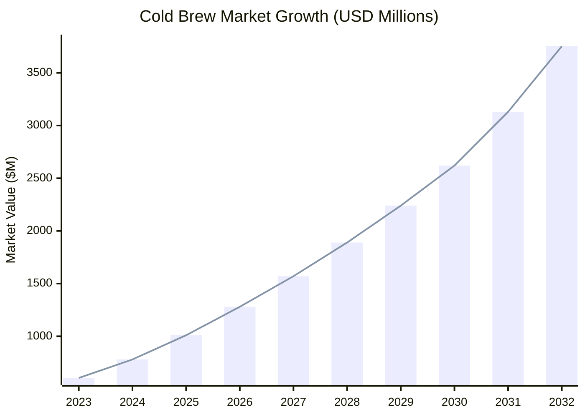
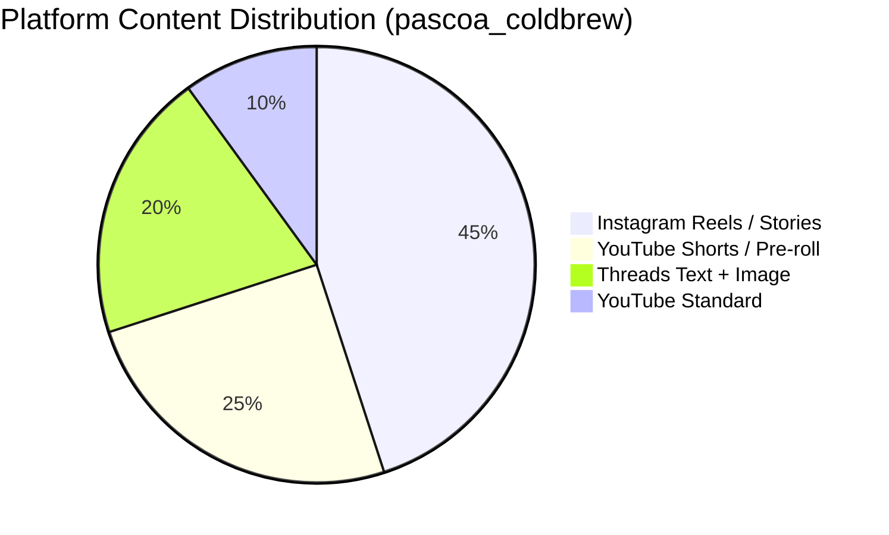

# 🐣 Páscoa Cold Brew — Marketing Research Brief
**Campaign:** `pascoa_coldbrew` · **Date:** 2026-03-26 · **Brand:** Cold Brew Coffee Co.
**Platforms:** Instagram · Threads · YouTube

---

## Executive Summary

Easter 2026 represents a high-signal opportunity for Cold Brew Coffee Co. The cold brew market is on a 6x growth trajectory (reaching $3.75B by 2032), Easter drives peak F&B gifting behavior among millennials, and social media buzz around Easter food & beverage peaks in mid-March — exactly now. The campaign angle is clear: **position cold brew as the Easter morning upgrade and the premium gift nobody returns.**

---

## 1. Industry Trends

| Signal | Data |
|---|---|
| Global cold brew market value (2023) | $604M |
| Projected market value (2032) | $3,751M |
| Flavored cold brew CAGR (2030) | 19.07% |
| Organic cold brew CAGR (2030) | 19.22% |
| UK consumers drinking cold brew monthly | 43% |
| Global consumers citing health as purchase driver | 62% |

**Key shift:** Cold brew has moved from a summer novelty to a year-round daily staple. Easter/spring is the seasonal activation window to reinforce this year-round habit.

---

## 2. Consumer Motivations

- **Easter gifting peak:** 69% of consumers celebrate Easter; millennials are the #1 Easter gift-givers (26% buy gifts vs. 23% average)
- **Premium food focus:** 95% of Easter shoppers plan to buy *something*; 69% target food & beverage
- **Smooth + health conscious:** Low acidity and no bitterness are top cold brew purchase drivers
- **FOMO + scarcity:** Limited-edition Easter drops drive purchase intent among Gen Z
- **Convenience desire:** Busy professionals want grab-and-go premium — cold brew delivers exactly that

---

## 3. Competitor Messaging

| Brand | Strategy | Takeaway |
|---|---|---|
| STōK Cold Brew | Ryan Reynolds celebrity partnership | Humor + mainstream cultural embed |
| Chameleon Cold-Brew | 100+ UGC influencers, diverse formats | Authentic voice scales reach (1M followers/month) |
| Dunkin | Seasonal cold brew menu expansion | Limited-time spring flavors drive urgency |
| Starbucks Asia | Ginger Honey Citrus cold brew (April 2025) | Localized, seasonal limited releases win |
| Coffee shops generally | Easter bundles + gift baskets | Bundling drives gifting-season AOV |

**Gap:** No premium RTD cold brew brand has owned the Easter morning narrative. This is our whitespace.

---

## 4. Content Topics (Ranked by Engagement Potential)

1. **Easter coffee bar setup** — spring morning aesthetic, trending on IG + TikTok
2. **Cold brew gift basket reveal** — UGC-friendly, shareable, high gifting intent
3. **"Your Easter ritual, upgraded"** — morning routine content with holiday hook
4. **Cold brew vs. hot coffee** — 'choose your Easter energy' comparison format
5. **Easter egg hunt parody** — cans hidden around the house (comedic, high share rate)
6. **Limited-edition can reveal** — even visual-only; drives FOMO + saves
7. **Easter brunch table setup** — aspirational aesthetic, high save/share rate

---

## 5. Platform Content Distribution

---

## 6. Marketing Angles

### Angle 1 — Easter Morning, Upgraded ⭐ PRIMARY
> "Most people wake up to chaos on Easter. You wake up to cold brew."

Position cold brew as the premium Easter morning ritual. Connects to the universal pain of a hectic holiday morning and the desire for a smooth, effortless start.

**Why it works:** Taps into aspirational lifestyle content, leverages the "upgrade" frame that resonates with millennials, and mirrors our core product truth (smooth, no bitterness).

---

### Angle 2 — The Easter Gift Nobody Returns
> "Chocolate? Flowers? Try again. Cold brew is the Easter gift that actually wins."

Position cold brew as the perfect Easter gift — premium, practical, universally loved.

**Why it works:** Directly leverages millennial gifting behavior data (26% plan to give Easter gifts). Humor angle differentiates from generic holiday copy.

---

### Angle 3 — Smooth as Easter Sunday
> "Easter Sunday. No chaos. No bitterness. Just smooth."

Use Easter's cultural associations with calm, renewal, and lightness to mirror cold brew's smooth, low-acid profile.

**Why it works:** Creates emotional resonance without product-heavy messaging. Works well as awareness/brand content.

---

### Angle 4 — Limited Edition Páscoa Drop
> "Páscoa 2026. One drop. Stock up."

FOMO + scarcity framing that treats the campaign itself as a limited-edition event.

**Why it works:** Gen Z responds to scarcity narratives. Works for countdown content and pre-launch teasers.

---

## 7. Top Ad Hooks

| Hook | Angle | Platform |
|---|---|---|
| "Your Easter morning just got a serious upgrade. ☕" | Morning upgrade | Instagram, Threads |
| "The Easter gift nobody returns." | Gifting | Instagram, YouTube |
| "Skip the hot mess. Cold brew your Easter." | Hot vs. cold contrast | Threads, YouTube |
| "Smooth as Easter Sunday. No bitterness allowed." | Smooth/calm | Instagram Stories |
| "This Easter, serve the good stuff." | Premium signal | All platforms |
| "Hot coffee on Easter? Life's too short for that." | Witty contrast | Threads |

---

## 8. Video Concepts

### Video 1 — Easter Morning Upgrade (20s · Instagram Reels)
**Hook:** "Most people wake up to chaos on Easter. You wake up to cold brew."
- Scene 1: Easter morning chaos animation (flying eggs, alarm, hot coffee spill)
- Scene 2: Hand reaches for cold brew; scene calms; amber + cold blue wash in
- Scene 3: Character energizes; sparkles burst + Easter egg motifs transform into energy icons
- Scene 4: CTA — "Upgrade Your Easter Morning"

### Video 2 — The Easter Gift Nobody Returns (15s · Stories/Shorts)
**Hook:** "Chocolate? Flowers? Try again."
- Scene 1: Strike-through on typical Easter gifts (animated SVG)
- Scene 2: Cold brew can slides in with Easter ribbon SVG
- Scene 3: "Zero returns since forever."
- Scene 4: CTA — "Grab Yours"

---

## 9. Scheduling Recommendations

| Platform | Best Publish Window | Format |
|---|---|---|
| Instagram | Fri 10AM + Sat 9AM + Easter Sun 8AM | Reels + Stories + Feed |
| Threads | Thu 8PM + Sat 10AM | Short text + image |
| YouTube | 2 weeks before Easter, Friday release | Shorts + pre-roll |

**Hashtag Strategy:**
- `#ColdBrewCoffeeCo` `#PascoaColdBrew` `#EasterCoffee` `#ColdBrew` `#MorningFuel`

---

## 10. Handoff Summary

**Biggest market opportunity:** Easter morning ritual + gifting angle. No premium RTD cold brew brand owns this space. First-mover advantage is real.

**Strongest ad hooks:**
1. *"Your Easter morning just got a serious upgrade."* — speaks directly to the millennial desire for a premium, effortless holiday start
2. *"The Easter gift nobody returns."* — humor + truth, highly shareable, leverages gifting behavior data

**Outputs saved to:** `outputs/pascoa_coldbrew_2026-03-26/`
- `research_results.json` ✅
- `research_brief.md` ✅
- `interactive_report.html` ✅

**Recommended next agent:** Ad Creative Designer — launch with the "Easter Morning Upgrade" angle at 1080×1080 for Instagram feed.

---
*Generated by Marketing Research Agent · Cold Brew Coffee Co. · 2026-03-26*
