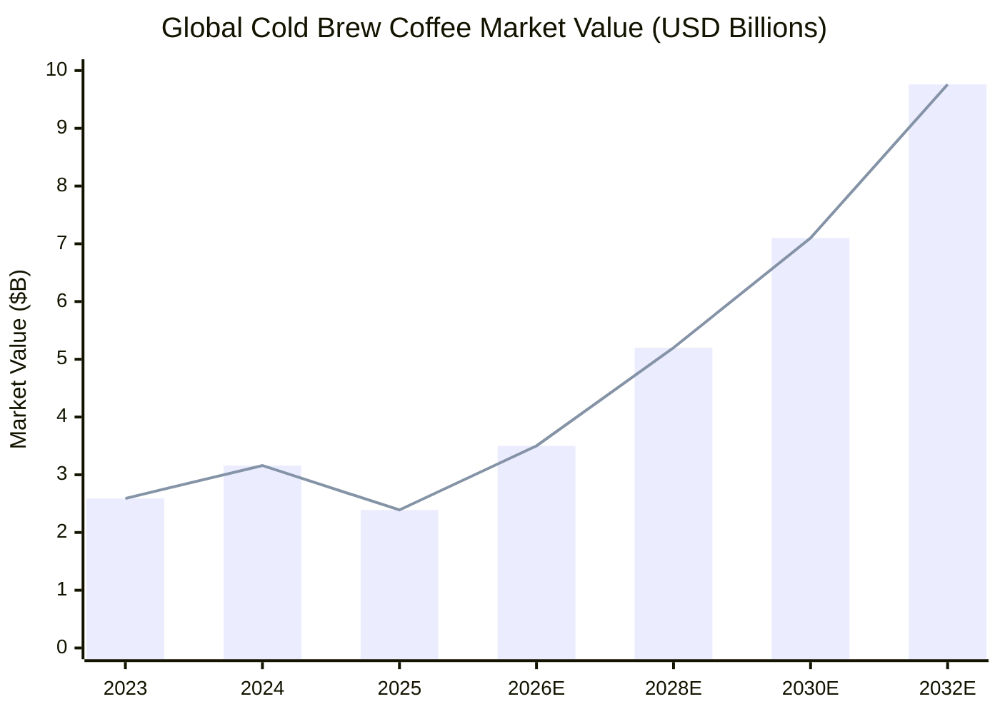
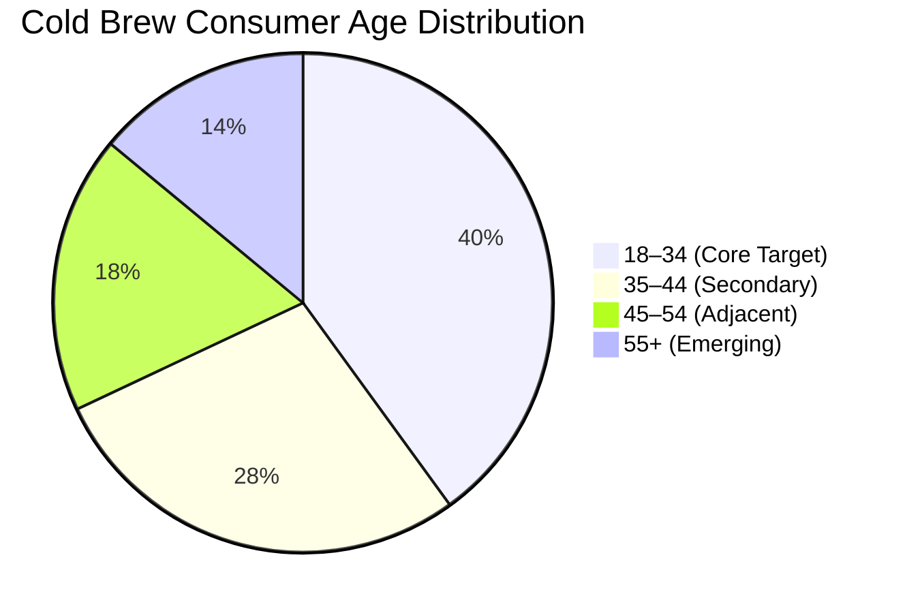
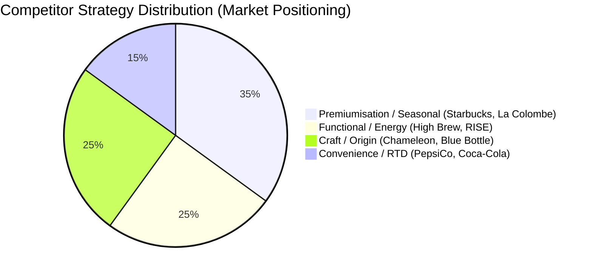

# Marketing Research Brief: Cold Brew Coffee Co.
**Task:** test_job_payload_1 | **Date:** 2026-03-15 | **Agent:** marketing-research-agent

---

## Executive Summary

The cold brew coffee market is one of the fastest-growing segments in the beverage industry, expanding at **22.1% YoY** — more than 4× the rate of overall coffee market growth. The core opportunity for Cold Brew Coffee Co. lies in a **white space that major competitors are not owning**: the emotional morning transformation narrative. Most brands compete on craft origins or functional caffeine numbers. The "better morning, zero bitterness" positioning is wide open.

**Biggest opportunity:** Own the "Upgrade Your Morning" angle — emotional, benefit-first, and directly tied to the audience's #1 pain point (sluggish, bitter, inconvenient hot coffee).

---

## 1. Market Size & Growth

**Key stats:**
- 2024 market: **$3.16B** (+22.1% YoY)
- 2025 market: **$2.39B** (revised base post-segmentation)
- 2032 projection: **$9.76B**
- US market alone: $752.4M in 2024 at 22%+ CAGR to 2030
- RTD format share: **75.11%** of all cold brew consumption

---

## 2. Consumer Segmentation

**Primary audience profile:**
- **Age:** 18–34 (40% of all cold brew consumers)
- **Segment:** Busy professionals, millennials, Gen Z morning routine seekers
- **Behaviour:** Daily coffee drinkers prioritising convenience and premium experience
- **Values:** Health-conscious, socially-driven, aesthetics-aware

---

## 3. Consumer Motivations & Pain Points

| Pain Point | Desire | Our Hook |
|---|---|---|
| Bitter, harsh hot coffee | Smooth, easy-drinking caffeine | "No bitterness. Pure boost." |
| No time to brew or wait | Grab-and-go convenience | "No brewing. No waiting." |
| Expensive daily café visits | Premium at-home experience | "Café quality. Home price." |
| Post-caffeine crash and jitters | Clean, sustained energy | "Clean caffeine. No crash." |
| Generic, unexciting morning | A ritual worth looking forward to | "Upgrade Your Morning." |

---

## 4. Competitive Landscape

**Key competitors:**
| Brand | Positioning | Messaging Focus | Weakness |
|---|---|---|---|
| Starbucks | Premium mainstream | Seasonal launches + Nitro | Corporate, not personal |
| Chameleon Organic | Clean-label craft | Ethical sourcing | Niche reach |
| High Brew | Functional energy | Caffeine numbers | No emotional resonance |
| La Colombe | Artisan premium | Origin storytelling | Premium-priced barrier |

**White space:** Emotional morning transformation — **"better morning" feeling** is unowned.

---

## 5. Top Marketing Angles

| Priority | Angle | Rationale |
|---|---|---|
| 1 | **The Smooth Energy Upgrade** | Directly addresses #1 pain point (bitterness/harshness); taste-forward |
| 2 | **Built for Busy** | Resonates with professionals; convenience + speed positioning |
| 3 | **Café Quality, Home Price** | Accessible luxury frame; counters $7 café spend objection |
| 4 | **Clean Caffeine Culture** | Health-alignment with millennial/Gen Z wellness values |

---

## 6. Top Ad Hooks (Ranked by Scroll-Stop Potential)

1. **"Still dragging this morning?"** — Pain-first hook; immediately relatable
2. **"Your 9AM just called. It wants an upgrade."** — Playful, brand-voice-aligned
3. **"Bitter coffee is a choice. Make a different one."** — Contrast + empowerment
4. **"No brewing. No waiting. Just smooth cold brew energy."** — Benefit list; fast scroll-stopper
5. **"Life's too short for bad coffee. ☕"** — Short, punchy; brand-voice gold

---

## 7. Content Topics (Organic + Paid)

| Topic | Format | Platform |
|---|---|---|
| "Your morning routine, upgraded" | Short-form video (Reels/Shorts) | Instagram, YouTube |
| "Smooth vs. bitter — the cold brew difference" | Explainer animation | YouTube Shorts |
| "Cold brew for busy professionals" | Carousel or static ad | Instagram |
| "Year-round cold brew — it's not seasonal" | Threads post + Reel | Threads, Instagram |
| "The $7 café alternative" | Static ad with price comparison | Instagram |

---

## 8. Keywords for Copy & YouTube

**Primary:** cold brew coffee, ready to drink coffee, morning routine coffee, smooth coffee, cold brew energy

**Secondary:** no bitterness coffee, low acidity coffee, cold brew at home, RTD cold brew, cold brew for professionals

**Lifestyle:** morning energy boost, clean caffeine, grab and go coffee, cold brew benefits

---

## 9. Recommended Next Steps

| Step | Agent | Priority |
|---|---|---|
| Generate Instagram static ad | Ad Creative Designer | High |
| Generate Remotion video ad | Video Ad Specialist | High |
| Write platform copy | Copywriter Agent | Medium |
| Prepare Publish MD | Distribution Agent | After copy |

**Recommended lead creative:** "Your Morning, Upgraded" — hooks on the transformation moment, aligns with brand CTA, and is the most emotionally resonant of all concepts.

---

*Generated by marketing-research-agent · Cold Brew Coffee Co. · 2026-03-15*
